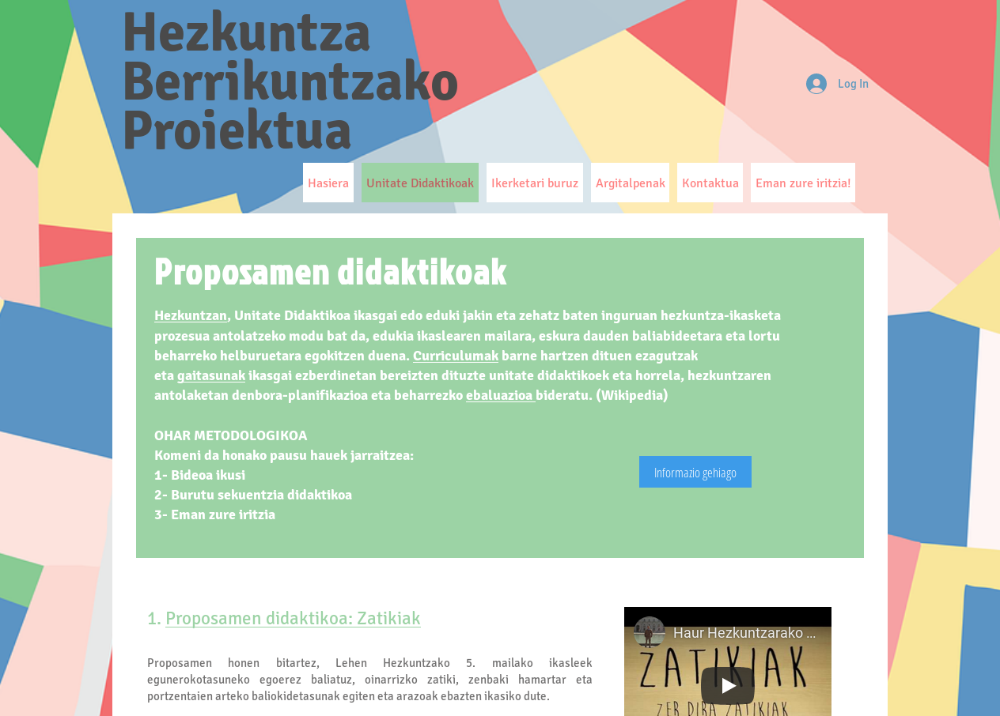

name: Azala
background-image: url('data/images/EHU_diapo_(01)_atzea-aldrabes.png')
background-position: 50% 25%
background-size: 100%
class: inverse, center
count: false


```{r setup, include=FALSE}
options(htmltools.dir.version = FALSE)
require(vcd)
source('1905030 HKrako objektuak.R')
```


#### Metodologías activas en Educación - Hezkuntza Kongresua

## Diferencias en la motivación y  en el estilo  <br>de aprendizaje en la creación del podcast por el alumnado universitario

#### Resultados significativos del análisis de encuestas

### Juan Abasolo, Aintzane Etxebarria, <br> Aitor Iglesias, Asier Romero

### EUDIA ikerketa-taldea

### <br>2019/06/04

???

### PIE: Hezkuntza Berrikuntzarako Proiektua

### Erronka

### Hiru fakultate

- Zientzia eta Teknologia
- Gizarte eta Komunikazio Zientzien Fakultatea
- Bilboko Hezkuntza Fakultatea

Lan kooperatiboa eta kolaboratiboa

* **Kooperatiboa**: Taldeetan lan egitea eskatu
* **Kolaboratiboa**: Fakultate guztietako ikasleek parte hartzea behar zen erronka onbidera eramateko

---

class: inverse, shuriken-200 with-border white

.blade1.bg-red.content.center[
]]
.blade2.bg-green[.content.vertical-rl.center[
]]
.blade3.bg-deep-purple[.content.center[
]]
.blade4.bg-orange[.content.sideways-rl.center.vmiddle[
]]
.hole.bg-black[.content.center.vmiddle[
# Videocast
]]

???

**Podcast**-en filosofian oinarrituta, bideoa erabili behar. 

---
class: middle, center, inverse, split-33 with-border

.column.bg-deep-purple[.content[
# Pasos del proyecto
]]

.column[.split-three[
  .row.bg-cyan[.content[
  ## 1ª fase
 Presentación y comienzo del trabajo
]]

  .row.bg-light-blue[.content[
  ## 2ª fase
 Alumnos de disciplinas y grados diferentes. Investigación acerca de los productos a generar
]]

  .row.bg-blue[.content[
  ## 3ª fase
 Publicación del material en la plataforma educativa de Internet
]]
]]

<div class="my-logo-left"></div> 

???

## Proiektuko urratsak

Zientzia eta tekonologiak: edukia azaldu

Gizarte Komunikazioa: ebazpen teknikoa

Hezkuntza Fakultatea: Diseinu didaktikoa (UD + Hezkuntza Plataforma)

---
class: bg-deep-purple

[](https://aromero4508.wixsite.com/prosodialhn/unitate-didaktikoak)

<div class="my-logo-left"></div> 

???

### https://labur.eus/UDak

---

class: inverse, center, middle, bg-deep-purple

<iframe width="560" height="315" src="https://www.youtube.com/embed/rUTpkepxggM" frameborder="0" allow="accelerometer; autoplay; encrypted-media; gyroscope; picture-in-picture" allowfullscreen></iframe>

### ...
esate baterako.

<div class="my-logo-left"></div> 

???

> Ikusten ari garen bideoak lanaren zati bat irudikatzeko balio du.

---
class: inverse, center, split-three with-border white

.column.bg-deep-orange[.content[
  ## Habitos de estudio
  
  # CHAEA
  
  ]]
.column.bg-teal[.content[
  ## Motivación
  
  # EMSI
  
]]
.column.bg-black[.content[
  ## Trabajo cooperativo
  
  .red[
  #### stand by
  ]
]]
<div class="my-logo-left"></div> 

???

# Hiru galdetegi:

Ikasketa ohiturez: CHAEA

Motibazioa: EMSI

Lan kooperatiboa: oraindik stand by

---
class: center, bottom, inverse, split-33 with-border white

.column[.content[

# Recogida de datos

]]

.column.bg-white[.content[
```{r echo=FALSE, out.width='100%', fig.height=10, eval=require('leaflet')}
library(leaflet)
leaflet() %>% 
  addTiles() %>%  # Add default OpenStreetMap map tiles
  setView(lng=-2.96745, lat=43.33089, zoom = 16) %>% 
  addProviderTiles(providers$Stamen.Toner)%>%
  addMarkers(lng=c(-2.96708, -2.96774, -2.97288), 
             lat=c(43.33073, 43.33033, 43.33310), 
             popup=c('Gizarte eta Komunikazio Zientzien Fakultatea', 'Zientzia eta Tekonologia Fakultatea', 'Bilboko Hezkuntza Fakultatea'))
```

]]
<div class="my-logo-left"></div> 

???

* Hiru fakultateetan.
* Klasean, euren ordenagailuekin
* Hiru galdetegiak batera

---
class: inverse, center, middle, split-33  with-border white

.column[.content[
  # Muestra
  
  ### n = `r sum(nrow(df.chaea))`
  
  ### 3 facultades

  ### 8 carreras

]]
.column.bg-white[.content[

```{r echo=FALSE, fig.height=9, fig.width=9, fig.retina=3}
## Laginaren deskribatzailik ---------------------------
##   
par(mfrow = c(2,2))
barplot(table(df.chaea$Edad), col = 1,
        main = 'Banaketa adinaren arabera', las = 2)
barplot(table(df.chaea$Faku), col = 1,
        main = 'Banaketa fakultatearen arabera')
barplot(table(df.chaea$Género), col = 1,
        main = 'Banaketa generoaren arabera')
barplot(table(df.chaea$Lengua.materna), col = 1,
        main = 'Banaketa ama hizkuntzaren arabera')
```

]]
<div class="my-logo-left"></div> 

???

### n = 164

17~38 artean ! 18-19 urte gehienak

BHF:3, ZeT:1

Heren bi emamukezko

Gehienek gaztelania ama hizkuntza

---

class: center, bottom, inverse, split-three with-border white

.column.bg-deep-orange[.content[

# CHAEA 
  
## Cuestionario de Estilos de Aprendizaje
  
  **Alonso, Gallego & Honey (1996)**

  ]]
.column.bg-orange[.content[

### Kolb (1984) 

Construyó la base teórica.

### Honey & Mumford (1986) 

Construyeron  *Learning Styles Questionnaire <br>(LSQ)* 

]]
.column.bg-amber[.content[

### Gallego & Honey (1996) 

Portaron al castellano

#### Perspectiva cuatridimensional

Activo

Pragmático

Reflexivo

Teorico

# CHAEA

]]
<div class="my-logo-left"></div> 

???

Cuestionario Honey Alonso de Estilos de Aprendizaje

* Teoria '84
* English '86
* Gaztelaniara itzuli '96

### Lau dimentsio ikasketa estiloetan

80 item, 20na item

* Ekintzailea
* Pragmatikoa
* Hausnarkorra
* Teorikoa


---
class: center, bottom, inverse, split-33 with-border

.column.bg-deep-orange[.content[
## Perspectiva cuatridimensional

.black[
|      | 10%         | 20%   | 40%      | 20%   | 10%        |
| ---  | ----------- | ----- | -------- | ----- | ---------- |
|      | M.Baja      | Baja  | Moder    | Alta  | M.alta     |
| Act. | 0-6         | 7-8   | 9-12     | 13-14 | 15-20      |
| Ref. | 0-10        | 11-13 | 14-17    | 18-19 | 20         |
| Teó. | 0-6         | 7-9   | 10-13    | 14-15 | 16-20      |
| Prg. | 0-8         | 9-10  | 11-13    | 14-15 | 16-20      |
]
]]

.column.bg-white[.content[


```{r echo=F, fig.align='center', fig.retina=3, fig.height=9, fig.width=10}
fmsb::radarchart( starrerako, axistype=1 , 
                  #custom polygon
                  pcol=colors_border , 
                  pfcol=colors_in , 
                  plwd=4 , 
                  plty=1,
                  #custom the grid
                  cglcol="grey", cglty=1, 
                  axislabcol="gray40", 
                  caxislabels=levels(df.chaea$activo.q), 
                  calcex = 0.7,
                  cglwd=0.8,
                  #custom labels
                  vlcex=0.9,
                  vlabels = c("Activo","Reflexivo","Teórico", "Pragmático"),
                  # Izenburua
                  title = 'Estilos de aprendizaje y facultades',
                  cex = 3
)

legend(x = 1, y = 1, 
       legend = paste(rownames(starrerako[-c(1,2),]), table(df.chaea$Faku), sep = ' n=' ), 
       bty = "n", 
       pch=20 , 
       col=colors_border, 
       text.col = "black",
       cex=1.5, 
       pt.cex=3)
```

]]

<div class="my-logo-left"></div> 

???

20 itemen balorazio ponderatua egiten da, balidazio prozesuan egin ziren kalkuluen  araberakoa.

On line erraz topaten da, norberak ikusi nahi badau be.

Lau dimentsioetako garapena batera ematen ditu.

Ez dugu aurkitu, ikuskera honetan, alde adierazgarririk

---
class:  inverse, center, middle, split-33 with-border

.column.bg-deep-orange[.content[

## Perspectiva monodimensional

```{r echo=FALSE, dev.args = list(bg = "transparent"), fig.retina=3}
vcd::mosaic(vcd::structable(df.chaea$Faku~df.chaea$nagusi), shade=TRUE, legend=TRUE)
```

]]

.column.bg-white[.content[
```{r echo=FALSE, fig.height=7, fig.width=9, fig.retina=3}
barplot(apply(taula.p.chaea, 2, function(x){x*100/sum(x,na.rm=T)}), 
        beside = F, 
        col = c( rgb(0.2,0.5,0.5,0.9), rgb(0.8,0.2,0.5,0.9) , rgb(0.7,0.5,0.1,0.9)),
        legend.text = levels(df.chaea$Faku), 
        names.arg = levels(df.chaea$nagusi),
        main = "Estilos de aprendizaje y facultades (valores relativos)"
        )
```
.bg-white[.red[.left[
```{r echo=FALSE}
ji.chaea.faku.nagusi.mono
```
]]]
]]

<div class="my-logo-left"></div> 

???

Informatzaile bakoitzaren estilo nagusiari begiratuta, desberdinak

$\chi^2$ 

Analisirako instrumentu honek diosku adierazgarritasun hori hor dagoela (estilo aktiboa komunikazio fakultatean gehiago)

---

class: center, bottom, inverse, split-three with-border white

.column.bg-teal[.content[
  # EMSI <br><br> Escala de Motivación SItuacional
  
  Versión española de la SIMS para evaluar la motivación situacional en educación
  
  **Martin-Albo, Nuñez, Navarro (2009)**

  ]]
.column.bg-green[.content[

### Self-determination theory 
Deci & Ryan (1985)


## Situational Motivation Scale <br> SIMS 

Guay, Vallerand, & Blanchard (2000)

]]
.column.bg-light-green[.content[

## Cuatro dimensiones

Motivación Intrínseca

Regulación Identificada

Regulación Externa

Amotivación

# EMSI

]]
]]
<div class="my-logo-left"></div> 

???

Itzulpena eta balidazioa.

85' teoria
2000 SIMS
2009 EMSI

# Lau dimentsio

16 item

* Berezko motibazioa
* Erregulatzaile ezagutua
* Kanpo erregulazioa
* Ez-motibazioa

---
class: center, bottom, inverse, split-33 with-border white
.column.bg-teal[.content[
# Items:<br>todos

Motivación Intrínseca

Regulación Identificada

Regulación Eterna

Amotivación

]]
.column.bg-white[.content[
.black[
```{r echo=FALSE}
knitr::kable(df.k, format = 'html')
```
]
]]

???

Hiru itemetan banaketa desberdina 

* 5. Porque disfruto con esta actividad 
* 9. Porque esta actividad es divertida 
* 14. Porque creo que esta actividad es importante para mí

---
class: center, middle, bottom, inverse, split-33 with-border white
.column.bg-teal[.content[
# Items:<br>todos

Motivación Intrínseca

Regulación Identificada

Regulación Eterna

Amotivación

]]
.column.bg-white[.content[

## Perspectiva general

```{r echo=FALSE, fig.retina=3}
plot(lik.emsi)
```

]]

???

Desberdintasun adierazgarria aurkitu da erdiko balioak erakusten dituen itemetan

---

class: center, bottom, inverse, split-33 with-border white
.column.bg-teal[.content[
# Motivación Intrínseca

.black[
```{r echo=FALSE}
knitr::kable(round(e.p.w.t1$p.value, 3), caption = paste(emsi.itemak[5], ''), format = 'html')
knitr::kable(round(e.p.w.t2$p.value, 3), caption = paste(emsi.itemak[9], ''), format = 'html')
```
]

]]
.column.bg-white[.content[
## Distribución por facultades
.pull-left[
```{r echo=FALSE, fig.retina=3, fig.height=10}
plot(lik.emsi.mintrinseca.faku)
```
]
.pull-right[
```{r echo=FALSE, fig.retina=3, fig.height=10}
plot(lik.emsi.mintrinseca.faku, type = 'density')
```
]
]]

???

# Test de Wilcoxon

5.ean ZeTkoek aurkakotasuna GKZ alde
9.ean ZeTkoek eta BHF aurkakotasun maila desberdinak, GKZ, aldekoa.

---

class: center, bottom, inverse, split-33 with-border white
.column.bg-teal[.content[

# Regulación identificada

.black[
```{r echo=FALSE}
knitr::kable(round(e.p.w.t3$p.value, 3), caption = paste(emsi.itemak[14], 'Test de Wilcoxon'), format = 'html')
```
]
]]

.column.bg-white[.content[
## Distribución por facultades

.pull-left[
```{r echo=FALSE, fig.retina=3, fig.height=10}
plot(lik.emsi.mregulacionidentificada.faku)
```
]
.pull-right[
```{r echo=FALSE, fig.retina=3, fig.height=10}
plot(lik.emsi.mregulacionidentificada.faku, type = 'density')

```
]
]]

???
# Test de Wilcoxon

14.ean ZeTkoek aurkakotasuna GKZ eta BHF alde

---
background-color: #eeeeaf
class: center, bottom

# Interpretación

--

## Diferencias estilo de aprendizaje y area de conocimiento

--

## Diferencias significativas motivacionales

???

### Ikasketa estiloa nagusiak ez datoz bat hiru fakuetan. Ekintzailea GKZ

### Berezko motibaziorik ez dute erakutsi ZeTekoek.

### Erregulatzaile ezaguna BHF eta GKZ, ZeT ez.


---
background-color: #eeeeaf
class: center, bottom

# Próximamente...

--

## Resultados de encuesta sobre trabajo cooperativo

--

## Analisis relacional de los tres cuestionarios

???

### Lan kooperatiboaren gaineko inkesteen analisia

### Hiru galdetegien erantzunak hartu-emanean.

---
class: center, middle, inverse

# Itaunik?

---
template: Azala